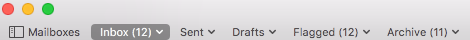

# Gapple

Adds Gmail style keyboard shortcuts to [Apple Mail](http://www.apple.com/osx/apps/#mail). Tested on [El Capitan](http://www.apple.com/osx/), may **not** work on older versions of OSX. Inspiration taken from [Gmailnator](https://github.com/nompute/GMailinator).

## Supported Shortcuts

### Navigation

| Key | Action |
| ----: | ------ |
| `!` | Mark as junk |
| `#` | Delete message |
| `/` | Find in mailbox/message |
| `?` | Open Keyboard shortcuts |
| `<shift> + i` | Mark as read |
| `<shift> + j` | Older conversation select |
| `<shift> + k` | Newer conversation select |
| `<shift> + u` | Mark as unread |
| `^!` | Mark as junk |
| `a` | Reply all |
| `c` | Compose message |
| `e` | Archive message |
| `f` | Forward message |
| `g then a` | [Go to Archive](#g-keys) |
| `g then c` | Go to Contacts |
| `g then d` | Go to Draft |
| `g then i` | Go to Inbox |
| `g then l` | Go to Label |
| `g then s` | [Go to Flaggged](#g-keys) |
| `g then t` | Go to Sent |
| `j` | Older conversation |
| `k` | Newer conversation |
| `l` | Open "copy to" menu |
| `n` | Read next message |
| `o` | Open message |
| `p` | Read previous message |
| `r` | Reply |
| `s` | Toggle flag |
| `u` | Back to thread list |
| `v` | Open "move to" menu |
| `y` | Archive message |

**NOTE:** `u` works only for open messages
**NOTE:** `^` = `Control` key

## G Keys

Gmail supports `g then (a, c, d, i, s, t)` shortcuts to go to specific mailboxes. In order for the `g then ...` configuration to work for `Archive` and `Flagged`, you will need to configure your `Favorites Bar` to include these two folders. You can have other folders as well, but you **must** include `Archive` and `Flagged`. Your `Favorites Bar` should look something like the following:



If you are not familiar with the `favorites bar`, see the following [instructions](https://support.apple.com/kb/PH22268?locale=en_US&viewlocale=en_US) for help.

## How to Install

1. Download [Gapple.mailbundle.zip](build/Gapple.mailbundle.zip) located in the [build](build) directory, **note** if your building the bundle then you don't follow this step
2. Enable `Mail.app` plugins: `defaults write com.apple.mail EnableBundles -bool true`, **note** you only need to do this once
3. Expand `Gapple.mailbundle.zip`
4. Copy `Gapple.mailbundle` to `~/Library/mail/bundles`, **note**: you may have to create the `bundles` folder

### Plugin Compatibility Error

`Apple Mail` requires a `Plugin Compatibility` [UUID](https://en.wikipedia.org/wiki/Universally_unique_identifier) in order for a `mailbundle` to load. If you get an error regarding `Gapple.mailbundle` when `Mail` loads, it is most likely due to the `UUID`. To fix this, follow these steps:

1. Download the project as laid out in [Setup Workspace](#setup-workspace)
2. From `terminal` run `defaults read /Applications/Mail.app/Contents/Info PluginCompatibilityUUID`
3. This will print the current Mail `UUID` to the screen
4. It should looks something like `DAF41AB7-F9AD-4273-9934-C81C74705B69`
5. `Copy` the value to the clipboard.
6. Edit the `info.plist` file located in `~/Desktop/Gapple/Supporting Files`
7. Add the `UUID` to the `SupportedPluginCompatibilityUUIDs` of the file
8. Save the `info.plist` and follow the [Compile](#compile) instructions

The `SupportedPluginCompatibilityUUIDs` section of the `info.plist` looks like this:

```xml
<key>SupportedPluginCompatibilityUUIDs</key>
  <array>
    <string>B61772F2-9975-4EC0-B22F-9A277C46ADD2</string>
    <string>0A13A9ED-4864-4F07-AE70-60FB2F7EA63D</string>
    <string>DAFFB2B4-77BC-4C25-8CE1-2405E652D54B</string>
    <string>2B98D2DD-000B-4521-83EB-7BFCB9B161C8</string>
    <string>608CE00F-4576-4CAD-B362-F3CCB7DE8D67</string>
    <string>1146A009-E373-4DB6-AB4D-47E59A7E50FD</string>
    <string>2183B2CD-BEDF-4AA6-AC18-A1BBED2E3354</string>
    <string>19B53E95-0964-4AAB-88F9-6D2F8B7B6037</string>
    <string>0941BB9F-231F-452D-A26F-47A43863C991</string>
    <string>04D6EC0A-52FF-4BBE-9896-C0B5FB851BBA</string>
    <string>FBE5B158-5602-4A6D-9CC5-8461B9B7054E</string>
    <string>1CD40D64-945D-4D50-B12D-9CD865533506</string>
    <string>88ED2D4C-D384-4BF5-8E94-B533455E6AAF</string>
    <string>F4C26776-22B3-4A0A-96E1-EA8E4482E0B5</string>
    <string>D1EFE124-86FF-4751-BF00-80B2C0D6F2E4</string>
    <string>800E5C92-87D3-429B-8740-5C6183CD13EA</string>
    <string>7C051997-F45A-4523-B053-2D262F94C775</string>
    <string>YOUR NEW UUID GOES HERE</string>
  </array>
```

## How to Build

### Setup Workspace

You will need to be somewhat familiar with `git` and `xcode`.

1. Open `terminal` and run the following command
```bash
mkdir ~/Desktop/test
mkdir ~/Desktop/Gapple
cd ~/Desktop/Gapple
git clone https://github.com/ironfish/Gapple.git
```

### Compile

1. Run `Xcode`
2. Select `Open...` from the `File` menu
3. Choose `~/Desktop/Gapple` as the project
4. Select `Build` from the `Product` menu

This will generate `Gapple.mailbundle` in the `~/Desktop/test` folder. Follow [How to Install](#how-to-install) for installation.

## To Do

1. Write tests
2. ~~Find a way to use `g` instead of the `ctrl` key~~
3. ~~Implement `g then l` for `Go to label`~~
4. ~~Implement `g then c` for `Open contacts`~~
5. ~~Implement `l` for `Open "copy to" menu`~~
6. ~~Implement `v` for `Open "move to" menu`~~
7. Implement `copy to` function
8. Implement `move to` function

## Disclaimer

I wrote this `project` to learn `Swift`. That being said, I am far from being a [Swift](https://developer.apple.com/library/ios/documentation/Swift/Conceptual/Swift_Programming_Language/) or [Objective-C](https://developer.apple.com/library/mac/documentation/Cocoa/Conceptual/ProgrammingWithObjectiveC/Introduction/Introduction.html) expert.
